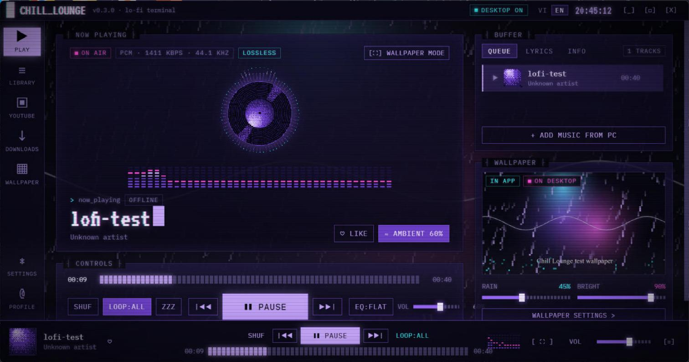
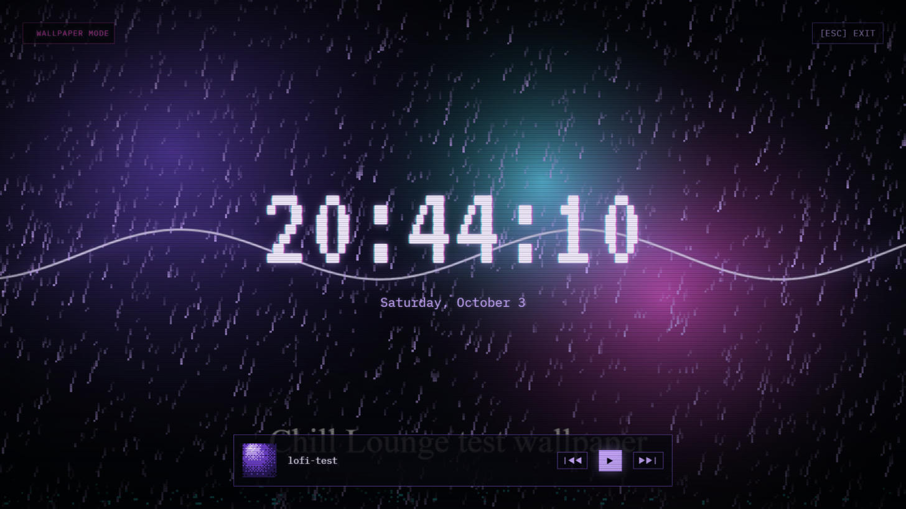

# Chill Lounge

**Hình nền động + trình phát nhạc lo-fi cho Windows, phong cách retro CRT terminal.**
*Live wallpaper + lo-fi music player for Windows, in a retro CRT terminal style.*



> Dự án cá nhân làm cho bạn bè. Màu sắc lấy cảm hứng từ cộng đồng Pyth — **không phải** sản phẩm chính thức của Pyth Network.
> *A personal project for friends. Colors inspired by the Pyth community — **not** an official Pyth Network product.*

---

## 🇻🇳 Tải và cài đặt

1. Vào [**Releases**](https://github.com/liemdak/chill-lounge/releases/latest) → tải file **`ChillLounge-Setup-x.y.z.exe`** (khoảng 100 MB).
2. Mở file vừa tải. Windows có thể hiện màn hình xanh **"Windows protected your PC"** vì app chưa có chữ ký số trả phí — bấm **More info → Run anyway**.
3. Chọn thư mục cài → **Install**. App có icon trên Desktop và Start Menu.
4. Từ bản sau, app **tự cập nhật**: khi có bản mới, góc trên hiện nút **[CÀI & KHỞI ĐỘNG LẠI]**.

**Yêu cầu:** Windows 10 hoặc 11, 64-bit. Hình nền desktop đã thử trên Windows 11 24H2+.

### Dùng thế nào

| Bạn muốn | Làm |
|---|---|
| Nghe nhạc trong máy | Tab **Thư viện** → **[+ THÊM NHẠC]** → chọn mp3 / flac / wav / m4a / mp4 |
| Âm nền mưa, đĩa than, lò sưởi, cà phê | Nút **≈ ÂM NỀN** ở màn Đang phát |
| Chỉnh âm | Nút **EQ** (Lo-Fi ấm, Bass sâu, Giọng rõ, Phẳng, hoặc tự chỉnh) |
| Hẹn giờ tắt nhạc | Nút **ZZZ** |
| Chọn ảnh / gif / video làm nền **trong app** | Tab **Hình nền** → **[+ CHỌN FILE]** → **[DÙNG TRONG APP]** |
| Đưa lên **desktop Windows** | Tab **Hình nền** → **[ĐẶT LÊN DESKTOP…]** → xác nhận. Gỡ lúc nào cũng được (trong app hoặc chuột phải icon ở khay) |
| Màn hình chờ toàn màn hình (đồng hồ + mưa) | Phím **F**, thoát bằng **Esc** |
| Đổi ngôn ngữ | Nút **VI / EN** trên thanh tiêu đề |

App **không bao giờ tự đổi hình nền desktop** nếu bạn chưa đồng ý, và mặc định không tự bật lại khi mở app.

## 🇬🇧 Download & install

1. Go to [**Releases**](https://github.com/liemdak/chill-lounge/releases/latest) → download **`ChillLounge-Setup-x.y.z.exe`** (~100 MB).
2. Run it. Windows may show **"Windows protected your PC"** because the app isn't signed with a paid certificate — click **More info → Run anyway**.
3. Pick a folder → **Install**. Shortcuts are added to the Desktop and Start Menu.
4. Later versions **update themselves**: when one is ready, an **[INSTALL & RESTART]** button appears at the top.

**Requires:** Windows 10 or 11, 64-bit. The desktop wallpaper is tested on Windows 11 24H2+.

Choosing an image/video in the **Wallpaper** tab only uses it **inside the app**. Putting it on your **Windows desktop** is a separate button with a confirmation, and you can remove it any time (in the app or from the tray icon).



---

## Tính năng / Features

- **Hình nền động** — ảnh, gif, video (mp4 / webm) phía sau icon desktop; nhiều màn hình; tự dừng khi chơi game toàn màn hình; mưa pixel, độ sáng, scanline CRT.
- **Trình phát nhạc** — đọc tên bài, nghệ sĩ, ảnh bìa và lời bài hát từ file; EQ + độ ấm băng từ; 4 lớp âm nền tạo bằng Web Audio; hẹn giờ ngủ; phím media; nhớ hàng chờ.
- **Giao diện CRT** — font VT323 + IBM Plex Mono (đủ dấu tiếng Việt), ảnh bìa dither thành pixel art, đĩa than pixel, phổ LED, chữ đánh máy + glitch.
- **Song ngữ** Việt / English · **tự cập nhật** qua GitHub Releases.

### Sắp có / Coming next (v0.4)

- Phát trực tiếp từ link YouTube (video / playlist) / *Play YouTube links*
- Tải nhạc từ link — chọn **chỉ âm thanh (mp3)** hoặc **cả video (mp4)** / *Downloads: audio-only or full video*
- Theme màu phosphor (tím, xanh lá, hổ phách) / *Phosphor color themes*

---

## Cho developer / For developers

```bash
npm install
npm run dev        # hot reload
npm run typecheck
npm run dist       # build dist/ChillLounge-Setup-<version>.exe
```

> Nếu `npm install` báo lỗi tải Electron (`fetch failed`): `$env:NODE_OPTIONS='--dns-result-order=ipv4first'` rồi `node node_modules/electron/install.js`.

File mẫu: `samples/neon-test.webm` (wallpaper), `samples/lofi-test.wav` (nhạc).

### Phát hành bản mới

1. Tăng `version` trong `package.json`, chạy `npm run dist`.
2. Tạo Release `vX.Y.Z` trên GitHub, đính kèm **3 file** trong `dist/`: `ChillLounge-Setup-X.Y.Z.exe`, `ChillLounge-Setup-X.Y.Z.exe.blockmap`, `latest.yml` (thiếu `latest.yml` thì app cũ không tự cập nhật được).

### Cấu trúc

```
src/
  main/                 Electron main process
    index.ts            cửa sổ, tray, IPC, tự cập nhật, chữ song ngữ của main
    media-protocol.ts   lounge-media:// — phục vụ file local (hỗ trợ tua video)
    settings.ts         %APPDATA%/Chill Lounge/settings.json
    tags.ts             đọc tag / ảnh bìa / lời (music-metadata)
    wallpaper/
      win32.ts          Win32 qua koffi: gắn cửa sổ sau icon desktop, phát hiện game fullscreen
      manager.ts        nền trong app (source) ≠ nền desktop (desktop, cần đồng ý)
  preload/              API cho renderer (window.lounge)
  renderer/
    wallpaper.html      cửa sổ hình nền desktop: media + mưa pixel + scanline
    src/
      i18n.tsx          toàn bộ chữ giao diện, vi + en
      styles/index.css  design tokens CRT (Tailwind v4 @theme) + class dùng chung
      audio/engine.ts   Web Audio: EQ, độ ấm, analyser, âm nền
      player/           usePlayer — hàng chờ, lặp, hẹn giờ, lưu phiên
      lib/              dither (pixel art), rain (mưa pixel), store
      components/       khung app, visualizer, hộp thoại, overlay CRT
      screens/          Đang phát, Thư viện, Hình nền, Cài đặt, màn sắp có
  shared/types.ts
```

### Ghi chú: hình nền trên Windows 11 24H2+

Từ 24H2, `SHELLDLL_DefView` (icon) và `WorkerW` đều là con của `Progman`. App gắn cửa sổ vào `Progman`, z-order giữa DefView và WorkerW (`src/main/wallpaper/win32.ts`). Những điểm dễ vấp đã xử lý:

1. `WS_EX_LAYERED` (do `setIgnoreMouseEvents`) phải gọi lại `SetLayeredWindowAttributes` sau khi đổi parent, nếu không DWM không vẽ.
2. Chromium chừa viền resize ẩn ~10px quanh cửa sổ frameless → đo client rect và nới cửa sổ.
3. `QUNS_BUSY` báo cả cửa sổ maximize thường; taskbar tự ẩn làm cửa sổ maximize phủ kín màn hình → chỉ coi là game khi cửa sổ foreground phủ kín màn hình **và** không có `WS_MAXIMIZE`.
4. Chỉ dựng lại cửa sổ hình nền khi màn hình đổi kích thước / scale (debounce), không phải mỗi lần work area đổi.
5. Khi cửa sổ fullscreen, Chromium nuốt keyDown của Esc → bắt ở `before-input-event` của main.
